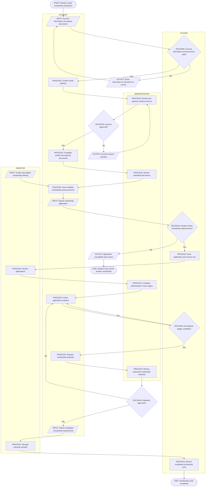
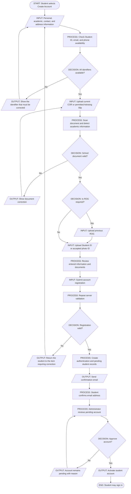
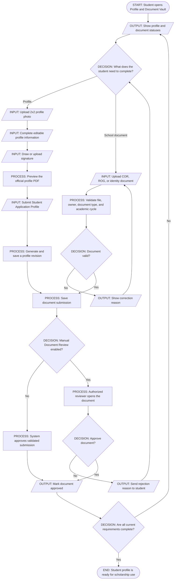
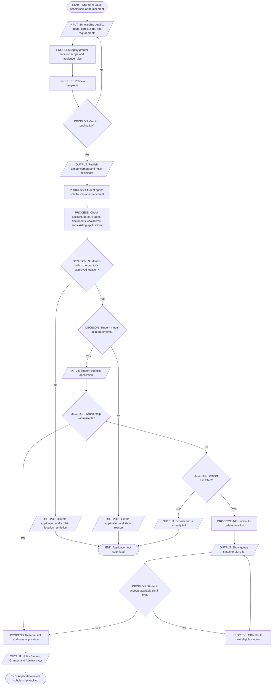
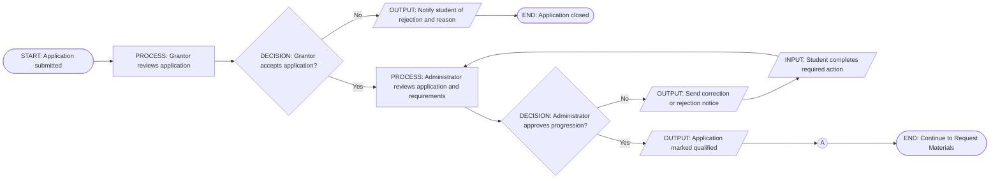
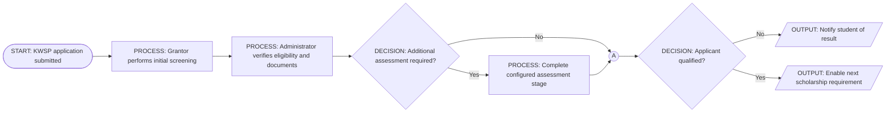
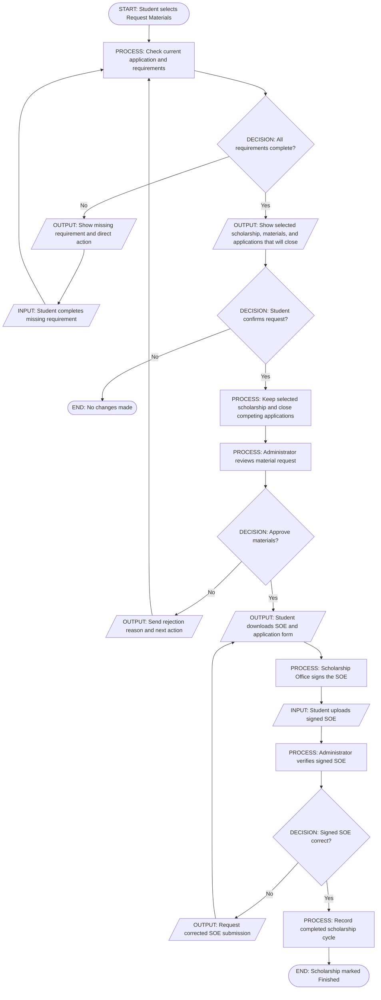
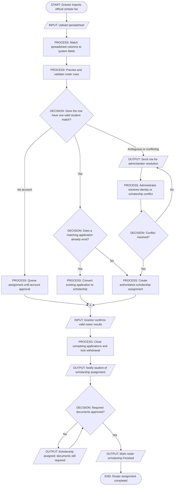
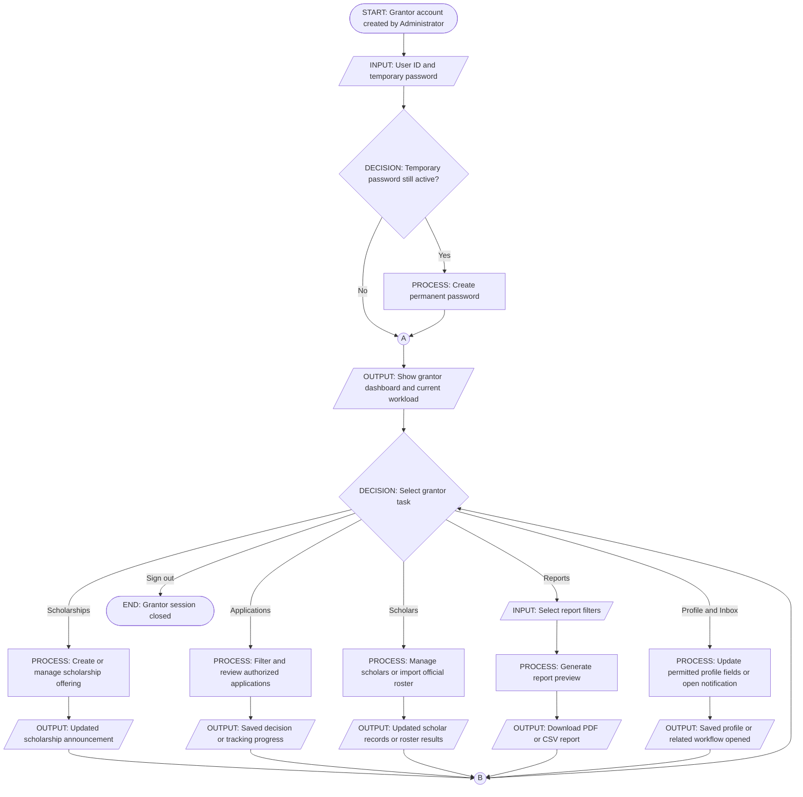
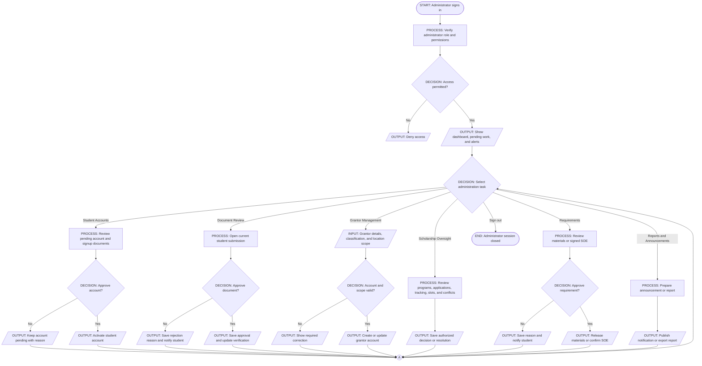

# BulsuScholar Thesis System Flowcharts

This document presents the main BulsuScholar workflows for thesis documentation.
It focuses on the interactions among the Student, Grantor, Administrator, and
System without including low-level implementation details.

The diagrams use standard flowchart shapes: rounded rectangles represent the
start or end, parallelograms represent input or output, rectangles represent a
process, diamonds represent a condition or decision, and circles represent a
connector.

## 1. System Actors

| Actor | Main responsibility |
| --- | --- |
| Student | Creates an account, maintains a profile, submits documents, applies for scholarships, follows application progress, and completes scholarship requirements. |
| Grantor | Publishes scholarship opportunities, reviews applicants, manages scholars, imports official scholar lists, and produces reports. |
| Administrator | Approves accounts, verifies documents, manages grantors, reviews scholarship requirements, resolves conflicts, and oversees the system. |
| System | Validates information, enforces scholarship rules, manages slots and records, generates notifications, and stores workflow results. |

## 2. Simplified Overall System Flow

## 3. Authentication and Account Creation

## 4. Student Profile and Document Verification

## 5. Scholarship Announcement and Application

## 6. Standard Scholarship Tracking

### KWSP Tracking Variation

For KWSP-managed scholarships, the system uses the same application and
document checks but follows the configured KWSP review stages before the
application continues to Request Materials.

## 7. Request Materials, SOE, and Completion

## 8. Official Roster Import and Scholarship Assignment

## 9. Grantor Portal Flow

## 10. Administrator Portal Flow

