# BulsuScholar Complete System Flow

This document describes the implemented BulsuScholar workflow in the current
repository. It covers the Student, Grantor, and Administrator portals and the
server-owned processes that connect them.

## 1. System Actors

| Actor | Main responsibility |
| --- | --- |
| Student | Creates an account, submits documents and a profile, applies for scholarships, follows application tracking, requests and downloads materials, and submits a signed SOE. |
| Grantor | Maintains scholarship announcements, receives scoped applications, reviews applicants, manages scholars, imports official scholar rosters, and creates grantor reports. |
| Administrator | Approves student accounts, reviews documents, manages grantors and location scopes, oversees scholarship decisions and tracking, approves materials, verifies SOE signing, publishes announcements, and generates system reports. |
| System | Performs document scans, validation, authorization, slot reservation, waitlist processing, automatic document approval when enabled, immutable revision storage, notifications, auditing, and email verification. |

## 2. How to Read the Flowcharts

Every diagram uses the same standard flowchart symbols:

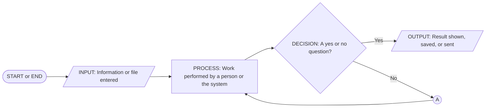

| Symbol | Name | Beginner meaning |
| --- | --- | --- |
| Rounded rectangle | Start or End | Where a workflow begins or finishes. |
| Parallelogram | Input or Output | Information enters the system, or the system produces a visible result. |
| Rectangle | Process | A person or the system performs an action. |
| Diamond | Condition / Decision | The flow checks a condition or asks a question, then follows the labeled arrow. |
| Circle | Connector | The flow continues in another role, section, or diagram without drawing a long crossing line. |
| Arrow | Flow line | Shows the next step. Text on the arrow explains the condition. |

The large diagram below gives the complete path. The smaller diagrams after it
explain each part in more detail. Connector letters restart in each diagram, so
an **A** connector only connects steps inside the diagram where it appears.

## 3. Master Student to Grantor to Admin Flowchart

```mermaid
flowchart TB
    Start([START: Student needs a scholarship])

    subgraph Student[STUDENT]
        SInput[/INPUT: Personal, school, contact, and address information/]
        SDocs[/INPUT: COR, required ROG, and accepted photo ID/]
        SConfirm[PROCESS: Confirm email address]
        SLogin[/INPUT: User ID and password/]
        SProfile[PROCESS: Complete Profile and Document Vault]
        SApply[PROCESS: Choose an announcement and apply]
        SAction[/OUTPUT: Inbox shows the next required step/]
        SRequest[PROCESS: Confirm Request Materials]
        SDownload[/OUTPUT: Download approved SOE and application form/]
        SSign[PROCESS: Bring SOE to the Scholarship Office for signing]
        SUpload[/INPUT: Upload the signed SOE/]
    end

    subgraph System[SYSTEM]
        SysUnique{DECISION: Student ID, email, and phone are available?}
        SysScan[PROCESS: Scan and validate signup documents]
        SysValid{DECISION: Signup information and documents are valid?}
        SysPending[PROCESS: Create Auth account and pending student record]
        SysDocPolicy{DECISION: Manual Document Review is enabled?}
        SysAuto[PROCESS: System approves new validated documents]
        SysActivate[/OUTPUT: Active student account/]
        SysProfilePolicy{DECISION: Manual review is enabled for the profile documents?}
        SysProfileAuto[PROCESS: System approves new validated profile documents]
        SysLoginCheck{DECISION: Login needs email verification?}
        SysCode[/OUTPUT: Six-digit code sent to registered email/]
        SysEligibility{DECISION: Student is eligible and a slot is available?}
        SysWaitlist[PROCESS: Add student to the ordered waitlist]
        SysApplication[/OUTPUT: Application created and slot reserved/]
        SysPreflight{DECISION: All material-request requirements are complete?}
        SysCommit[PROCESS: Keep selected scholarship and close competing applications]
        SysFinish[PROCESS: Save signed SOE version and complete the cycle]
    end

    subgraph Grantor[GRANTOR]
        GOffer[/INPUT: Scholarship details, dates, slots, requirements, and images/]
        GPublish[PROCESS: Preview recipients and publish the announcement]
        GReview[PROCESS: Review the grantor's own applications]
        GStage[PROCESS: Complete grantor-owned application stages]
        GRoster[/INPUT: Official scholar roster spreadsheet/]
        GReport[/OUTPUT: Filtered applicant or scholar report/]
    end

    subgraph Admin[ADMINISTRATOR]
        APending[PROCESS: Review pending account and signup documents]
        AApprove{DECISION: Approve the student account?}
        ADocuments[PROCESS: Review current COR, ROG, ID, and profile]
        AStages[PROCESS: Complete administrator-owned stages]
        AMaterials{DECISION: Approve requested materials?}
        ASoe{DECISION: Downloaded SOE is correct for signing?}
        AConflict[PROCESS: Resolve roster conflicts when needed]
        AReport[/OUTPUT: Administration reports and audit records/]
    end

    Start --> SInput --> SysUnique
    SysUnique -- No --> SInput
    SysUnique -- Yes --> SDocs --> SysScan --> SysValid
    SysValid -- No: show correction --> SDocs
    SysValid -- Yes --> SysPending --> SysDocPolicy
    SysDocPolicy -- Yes --> CEmail((A))
    SysDocPolicy -- No --> SysAuto --> CEmail
    CEmail --> SConfirm --> CAccountReview((C))
    CAccountReview --> APending --> AApprove
    AApprove -- No: remain pending --> APending
    AApprove -- Yes --> SysActivate --> SLogin --> SysLoginCheck
    SysLoginCheck -- Yes --> SysCode --> SLogin
    SysLoginCheck -- No --> SProfile --> SysProfilePolicy
    SysProfilePolicy -- Yes --> ADocuments
    SysProfilePolicy -- No --> SysProfileAuto --> CPublished

    GOffer --> GPublish --> CPublished((B))
    ADocuments --> CPublished
    CPublished --> SApply --> SysEligibility
    SysEligibility -- No slot, waitlist open --> SysWaitlist --> SAction
    SysEligibility -- Not eligible --> Blocked[/OUTPUT: Apply is disabled and the reason is shown/]
    SysEligibility -- Yes --> SysApplication --> GReview --> GStage --> AStages --> SAction

    SAction --> SRequest --> SysPreflight
    SysPreflight -- No --> Blocker[/OUTPUT: Show the missing requirement and direct action/]
    Blocker --> SAction
    SysPreflight -- Yes --> SysCommit --> AMaterials
    AMaterials -- No --> MaterialReject[/OUTPUT: Rejection reason sent to Student Inbox/]
    MaterialReject --> SAction
    AMaterials -- Yes --> SDownload --> ASoe
    ASoe -- No --> SoeRetry[/OUTPUT: Student must download a corrected SOE/]
    SoeRetry --> SDownload
    ASoe -- Yes --> SSign --> SUpload --> SysFinish --> End([END: Scholarship cycle finished])

    GRoster --> RosterDecision{DECISION: Every roster row has one valid match?}
    RosterDecision -- No --> AConflict --> RosterDecision
    RosterDecision -- Yes --> SysApplication
    GReview --> GReport
    AConflict --> AReport
```

## 4. Authentication and Account Creation

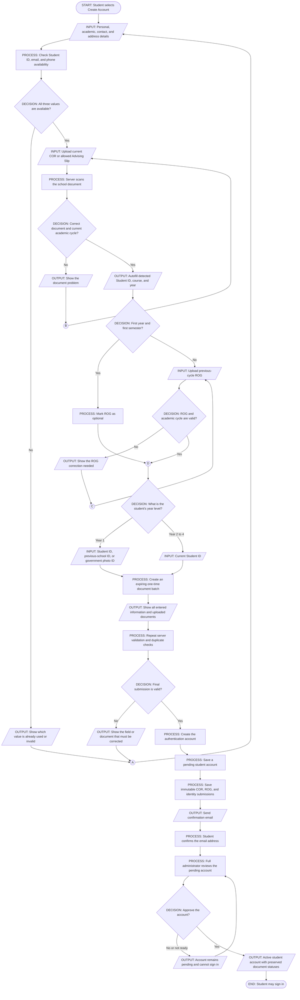

### Signup rules

1. Student ID, email address, and Philippine mobile number are checked while the student types and are checked again on final submission.
2. The backend, not the browser, rescans the uploaded signup documents and decides the academic-cycle and document requirements.
3. A first-year, first-semester student does not need a ROG. All other students need the previous-cycle ROG.
4. Year 1 accepts a Student ID, previous-school photo ID, or government photo ID. Years 2 to 4 require a Student ID.
5. A COR year mismatch is stored for administrator review instead of silently replacing the student's declared year.
6. Street/Subdivision and Postal Code are optional. Province, City/Municipality, and Barangay remain part of scope validation.
7. The account remains in `pending_students` after email confirmation. Only a full administrator can activate it.

## 5. Login, Lockout, Recovery, and Email Verification

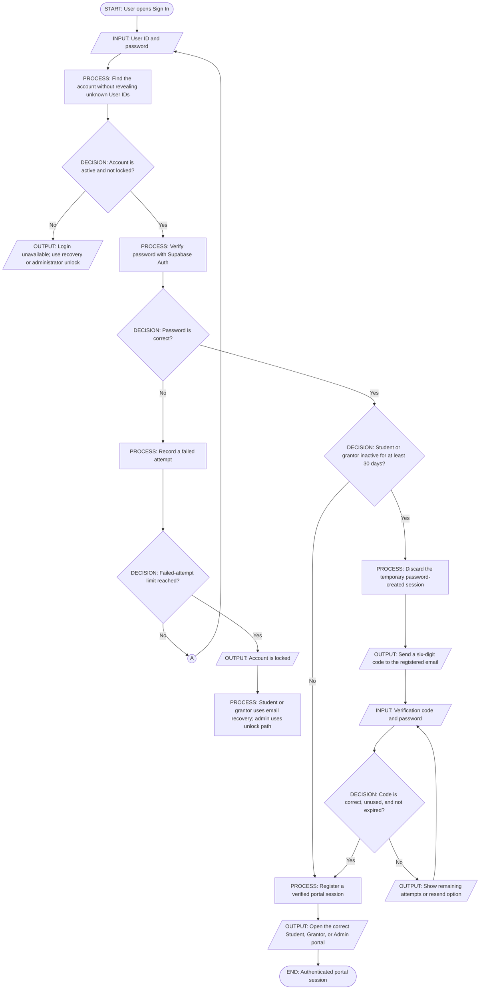

Security behavior:

- Email verification is a password-plus-email-code second factor for approved students and grantors after 30 days without meaningful activity.
- Codes expire after 10 minutes, allow three attempts, have a 60-second resend delay, and permit five sends per hour.
- Protected requests require a valid Supabase bearer token, matching portal actor headers, an active account, and a registered verified session.
- Password recovery responses are generic so unknown User IDs are not disclosed.

## 6. Student Profile and Document Verification

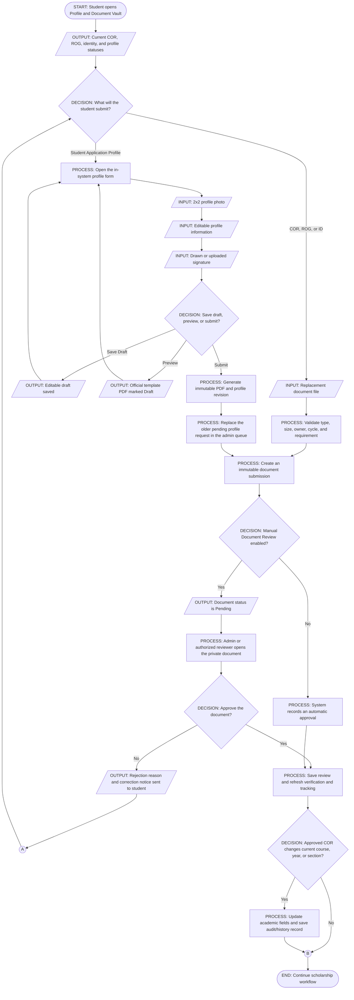

### Profile rules

- Student ID, email, contact number, course, year, and section are locked after account creation and come from the authoritative student record.
- Names, birth date, guardian information, college, permanent address, profile photo, and signature are editable where permitted.
- Every submission creates a new immutable revision and PDF. Historical revisions are preserved.
- The admin queue shows only the newest Student Application Profile request per student. An older pending request becomes `superseded` and cannot be reviewed.
- Grantors can only open approved student identity documents for students who applied to or are active scholars of that grantor.
- When manual review is disabled, only new server-validated submissions are automatically approved. Existing pending or rejected records do not change.

## 7. Scholarship Announcement and Application Flow

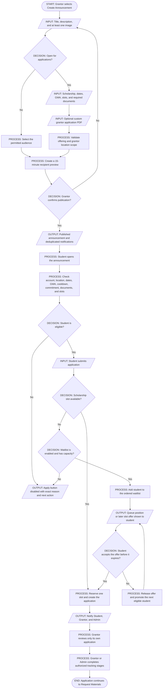

### Application checks

The server checks all of the following before committing an application:

- active student account and no unresolved roster conflict;
- active grantor and open scholarship announcement;
- approved municipality when location scope is enforced;
- active application window;
- minimum GWA and required current-cycle documents;
- no blocking scholarship commitment;
- no active rejection or withdrawal cooldown for the same grantor;
- no duplicate application;
- configured slot capacity or available waitlist capacity.

## 8. Standard Scholarship Tracking

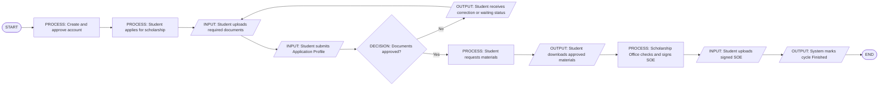

When the application started from an announcement, **Applying via Announcement** is inserted after Creation of Account.

### KWSP tracking variation

```mermaid
flowchart LR
    Start([START]) --> Account[PROCESS: Create and approve account]
    Account --> Apply[PROCESS: Student applies for KWSP]
    Apply --> Documents[/INPUT: Required documents/]
    Documents --> Profile[/INPUT: Student Application Profile/]
    Profile --> DocReview{DECISION: Documents approved?}
    DocReview -- No --> Correction[/OUTPUT: Student corrects or waits for review/] --> Documents
    DocReview -- Yes --> AdminReview[PROCESS: Admin Review]
    AdminReview --> Interview[PROCESS: Interview]
    Interview --> AppReview[PROCESS: Application Review]
    AppReview --> Screening[PROCESS: Final Screening]
    Screening --> Materials[PROCESS: Request Materials]
    Materials --> Download[/OUTPUT: Download approved materials/]
    Download --> Signing[PROCESS: Scholarship Office signing]
    Signing --> SignedSoe[/INPUT: Upload signed SOE/]
    SignedSoe --> Finish[/OUTPUT: System marks cycle Finished/]
    Finish --> End([END])
```

Tracking ownership:

| Stage | Primary owner |
| --- | --- |
| Account creation | System and Admin |
| Application | Student |
| Document upload | Student, with system validation |
| Student Application Profile | Student |
| Document Review | Admin/authorized reviewer or System when auto-review is enabled |
| Admin Review, Interview, Application Review, Final Screening | Admin/Scholarship Office |
| Request Materials | Student, followed by Admin approval |
| Download Materials | Student |
| Signing of Materials | Scholarship Office/Admin verification |
| Upload Signed SOE | Student |
| Finish | System |

## 9. Request Materials, SOE, and Completion

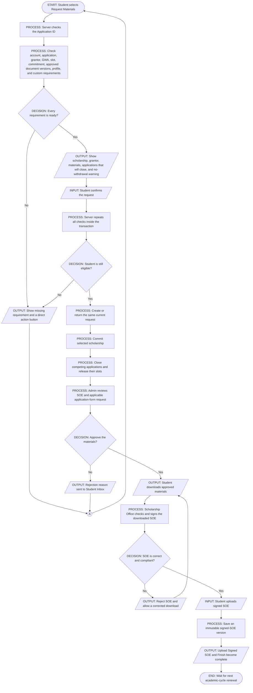

The materials request always includes the SOE and the applicable default or custom application form. Repeated requests are idempotent and do not consume another slot or close applications twice.

## 10. Official Roster Import and Automatic Scholarship Assignment

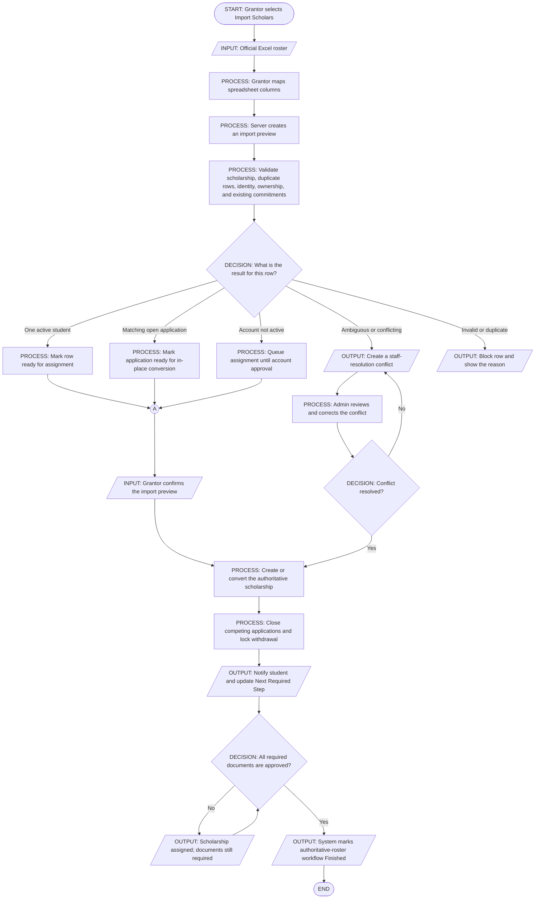

Roster rules:

- A validated official roster is authoritative for the award, but it does not fabricate document uploads, SOE downloads, or signatures.
- A matching application is converted without losing its ID, documents, tracking, or history.
- Re-uploading the same roster is idempotent.
- Conflicting grantors, ambiguous identity, and unrecognized scholarships require staff resolution.
- The student cannot withdraw from an active authoritative-roster scholarship.
- Completion occurs automatically only after all applicable documents are approved.

## 11. Inbox and Notification Flow

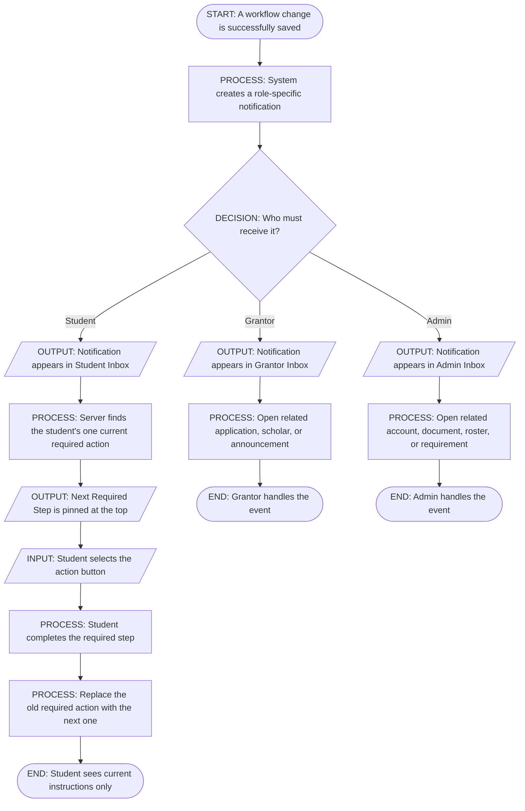

Student required-action priority is derived from the current authoritative state. It can direct the student to document correction, profile completion, application-specific requirements, review waiting, materials, waitlist offers, signed SOE, or cycle completion. It is replaced as progress changes instead of creating multiple stale pinned actions.

## 12. Grantor Portal Flow

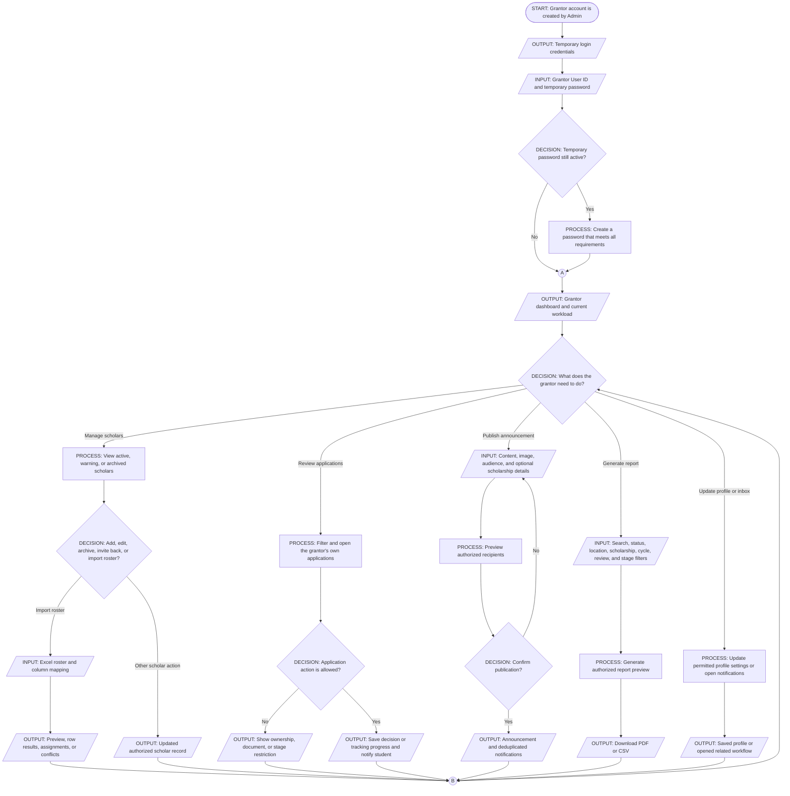

1. **Account setup:** An administrator creates the grantor Auth account, profile, classification, and initial location scope together. New grantors must change the temporary password.
2. **Dashboard:** The grantor sees counts, application activity, scholar status, scholarship performance, and recent records limited to its own account.
3. **Scholars:** The grantor views active, warning, and archived scholars; adds or edits permitted records; imports official rosters; invites eligible archived scholars back; and cannot alter another grantor's records.
4. **Applications:** The grantor searches and filters by status, location, scholarship, academic cycle, document-review state, and tracking stage. The grantor can review its own applications and advance only allowed workflow stages.
5. **Documents:** The grantor can view approved documents for its own applicants or scholars. Pending/rejected identity documents and unrelated student documents are not exposed.
6. **Announcements:** The grantor creates an image-backed informational announcement or scholarship offering, previews the immutable audience snapshot, publishes once, edits permitted content, archives, or republishes under server checks.
7. **Audience:** Targets include All Students, Scholarship Applicants, and Active Scholars, with optional application status, course, and year filters. Preview returns counts/snapshots, not unrestricted student data.
8. **Slots and waitlist:** The grantor configures slots. The system reserves and releases slots transactionally, sends low-slot notices, and manages waitlist offers.
9. **Reports:** The grantor generates preview-first PDF or CSV reports using only authorized applicant/scholar data and the active filters.
10. **Profile and Inbox:** The grantor updates permitted profile fields and custom application-form settings, reads workflow notifications, and changes the temporary password.

## 13. Administrator Portal Flow

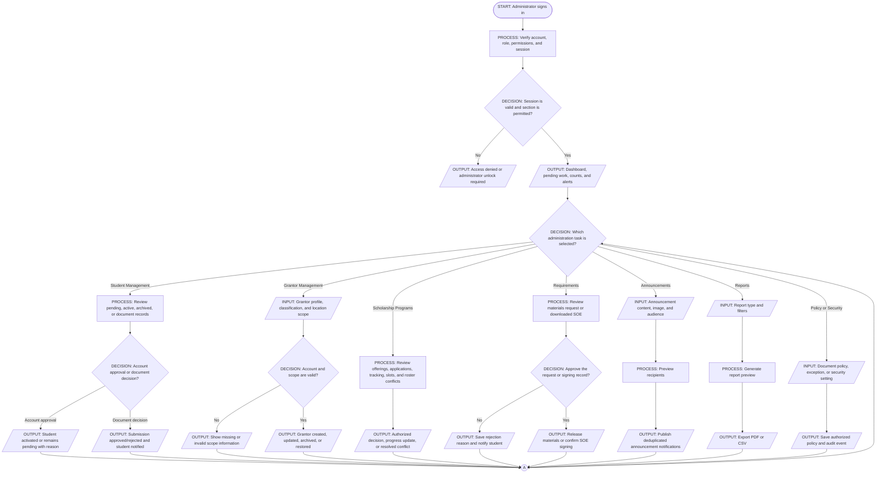

1. **Dashboard:** View system totals, pending work, trends, scholarship activity, and quick links.
2. **Student Management:**
   - review email-confirmed pending accounts and their signup COR, ROG, and identity documents;
   - approve accounts as a full administrator;
   - view active/archived student records;
   - run authorized Student ID correction;
   - open the Document Review queue and review current immutable submissions.
3. **Document Policy:** A full administrator controls COR/Advising Slip intake policy, Manual Document Review, and individual exceptions. Policy changes affect new submissions only.
4. **Grantor Management:** Create grantor accounts, set classification, enforce and edit approved municipalities, archive/reactivate accounts, and preserve Scholarship Office Managed scholars after grantor archival.
5. **Scholarship Programs:** Monitor offerings, applications, slots, commitments, application tracking, grantor decisions, roster assignments, archived records, and conflict resolution.
6. **Requirements:** Review material requests, approve or reject SOE/application-form release, verify downloaded SOE signing, and reopen an incorrect signed-SOE submission with a required reason.
7. **Announcements:** Create admin announcements with images, preview the selected audience, publish deduplicated notifications, and manage current/archived notices.
8. **Reports:** Preview and export PDF or CSV reports for students, grantors, scholarships, requirements, compliance, and informational recommendation scores.
9. **Security and Inbox:** Manage permitted account/security settings, receive system events, and access only sections granted by the admin permission set.

## 14. Location Scope Flow

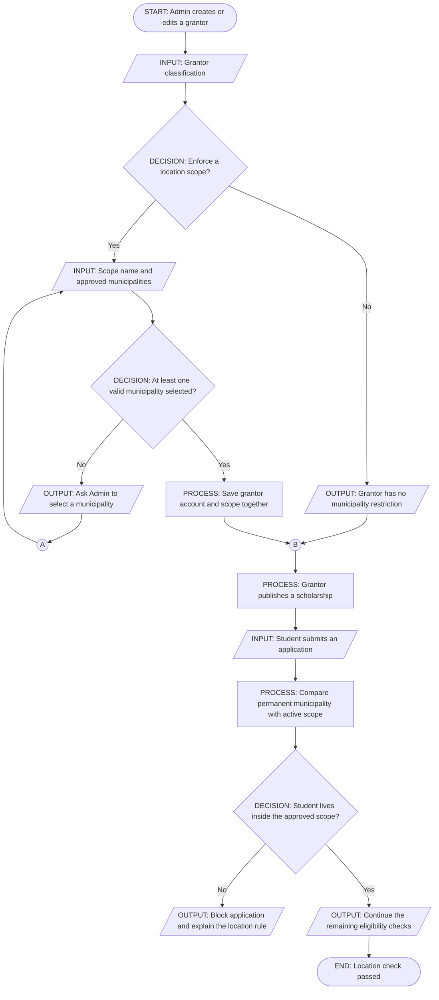

## 15. Archive, Rejection, Withdrawal, and Cooldown Flow

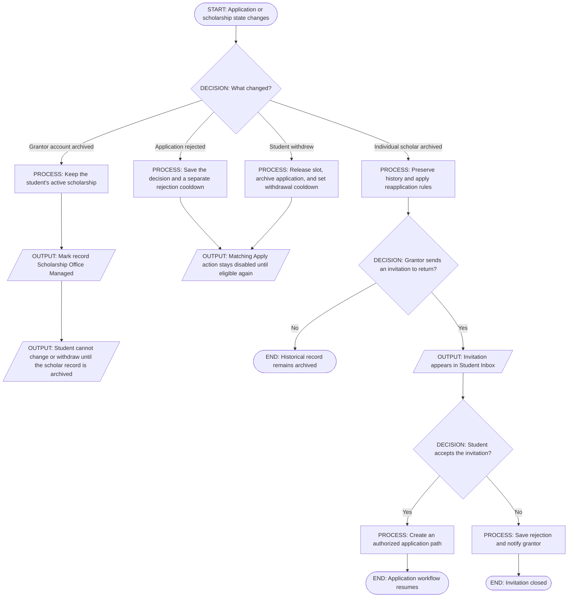

## 16. Primary Portal Screens

### Student

- Dashboard
- Announcements and Announcement Details
- Inbox with Next Required Step
- Scholarships and application tracking
- Recommended Scholarships
- Profile and Document Vault
- Student Application Profile Form

The student History screen is intentionally not exposed in the current frontend. Immutable history and audit records remain in the backend for operational integrity.

### Grantor

- Dashboard
- Scholars
- Applications
- Announcements
- Inbox
- Profile and password change
- Report preview/export modals within the relevant workspaces

### Administrator

- Dashboard
- Inbox and Notifications
- Student Management: Pending Accounts, Document Review, active and archived records
- Grantor Management
- Scholarship Programs
- Requirements and SOE Checking
- Announcements
- Report Generation
- Admin Profile

## 17. Authority and Data Boundaries

1. The browser never decides approval, ownership, slots, scope, commitment, or final eligibility.
2. Student identity is derived from the authenticated session for student-owned operations.
3. Grantors are restricted to their own applications, scholars, announcements, scope, and reports.
4. Full-admin-only operations include student account approval and global document-policy changes.
5. Uploaded documents, profile photos, generated PDFs, signatures, recovery evidence, and signed SOEs use private Storage and authenticated content endpoints.
6. Profile revisions, document submissions, reviews, application snapshots, roster imports, and signed SOEs preserve immutable historical versions.
7. Important transitions use server-owned transactions or RPCs and create notifications and audit records only from committed state.
8. Direct public table mutation is not the source of authority for protected workflows.

## 18. Complete Operational Sequence

1. The admin configures academic-cycle settings, document policy, security policy, grantor accounts, and grantor location scopes.
2. A grantor signs in, changes the temporary password, completes its profile, and publishes scholarship offerings with images, rules, dates, documents, and slots.
3. A student creates an account by completing the COR-first document sequence and confirming email.
4. The full admin reviews the pending account and activates it. Signup document review remains separate from account approval.
5. The student signs in, uploads a profile photo, completes the in-system Student Application Profile, and maintains current-cycle COR, ROG, and identity submissions.
6. Documents are manually reviewed or system-approved according to the active policy. Rejections return to the student with a reason and a replacement path.
7. The student browses eligible announcements and recommendations. The backend enforces account, scope, GWA, document, cooldown, commitment, date, slot, and duplication rules.
8. An eligible application reserves a slot atomically. If no slot is available and waitlisting is enabled, the student enters the ordered queue.
9. Grantor and admin users review the application and complete only the stages they own. The Student Inbox always shows the current next required action.
10. When all preconditions are met, the student opens Request Materials. The server preflight explains every blocker before confirmation.
11. A successful material request commits the selected scholarship, closes competing applications, releases competing slots, and creates the SOE/application-form request.
12. The admin approves the requested materials. The student downloads them, obtains the Scholarship Office signature, and uploads the signed SOE.
13. The system stores the signed-SOE version and marks the scholarship cycle Finished. The next cycle restarts at document renewal.
14. Alternatively, a grantor may import an official roster. A unique match assigns or converts the scholarship immediately, while required document approval remains mandatory. Conflicts go to the admin.
15. Throughout the lifecycle, notifications, required actions, audit events, private files, immutable revisions, reports, slot changes, and archive/cooldown rules remain synchronized with the committed server state.
